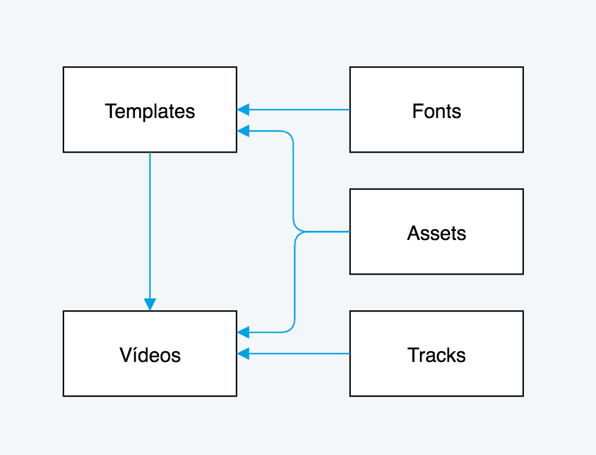

# Introdução

Bem-vindo a API da Chiligum! Você pode usar nossa API para gerar vídeos customizados em massa.

Temos exemplos em Shell e Ruby. Você pode usar qualquer linguagem que tenha suporte a HTTP.

Nossa API é composta por **templates**, **tracks**, **assets**, **fonts** e **vídeos**. Sendo eles:

**Templates** armazena o aepx gerado pelo AfterEffects, assets estáticos, fonts e configurações do template


**Tracks** música do vídeo em mp3. Sendo opcional caso o vídeo não tenha uma faixa de áudio.


**Assets** responsável por armazernar todos vídeos e imagens que são usados no template como assets estáticos e nos vídeos como um logo ou foto enviada por um usuário.


**Fonts** caso o template tenha alguma font customizada você deve fazer o upload delas neste end-point e informar o link 
dentro do end point de templates.


**Vídeos** recebe as informações enviadas a patir de tracks, templates e assets.




# Autentificação

> Para autentificar passe o token no header em cada request:

```ruby
require 'httparty'

headers = { 
  'token' => 'seutoken',
  'Content-Type' => 'multipart/form-data'
}

request = HTTParty.get("https://api.chiligumvideos.com", headers: headers)
request.body
```


```shell
curl "https://api.chiligumvideos.com/"
  -H "token: seutoken"
```

> Tenha certeza que você mudou `seutoken` com seu token da API.

Para ter acesso a nossa API você deve criar uma conta em [nosso sistema](http://api.chiligumvideos.com/credentials).

Após criar a conta você deve entrar em contato conosco para mudarmos o status da conta para enabled.

Em nosso sistema no meu "Credentials" você pode pegar o token de acesso. Ele deve ser passado a cada requisição através dos headers:

`token: seutoken`

Também passe o content type nos headers para:

`Content-Type: multipart/form-data`

<aside class="notice">
Você deve substituir <code>seutoken</code> para o token da sua conta.
</aside>

# Assets

## Overview

Todos os assets (imagens e vídeos) utilizados dentro do template ou como input de vídeos devem ser feitos o upload através deste end-point. No momento não suportamos assets de sites ou sistemas de terceiros.

## Receber todos Assets

```ruby
require 'httparty'

headers = { 
  'token' => 'seutoken',
  'Content-Type' => 'multipart/form-data'
}

assets = HTTParty.get("https://api.chiligumvideos.com/api/assets", headers: headers)
assets.body
```

```shell
curl "https://api.chiligumvideos.com/api/assets"
  -H "token: seutoken"
```

> O comando acima retorna um JSON:

```json
[
  {
    "id":1,
    "name":"Abertura_PreRender.mp4",
    "url":"https://s3.amazonaws.com/teaserapi/assets/b4c067a22d9a272493340c654bd4f2b7802d06e3.mp4",
    "hash_name":"b4c067a22d9a272493340c654bd4f2b7802d06e3.mp4",
    "attachment_file_name":"Abertura_PreRender.mp4",
    "attachment_content_type":"application/octet-stream",
    "attachment_file_size":"728537",
    "created_at":"2017-08-23T21:30:26.713Z",
    "updated_at":"2017-08-23T21:30:26.713Z"
  },
  {
    "id":2,
    "name":"logo",
    "url":"https://s3.amazonaws.com/teaserapi/assets/55780e178d171747c0cb81597262f3c7abbae9b8.png",
    "hash_name":"55780e178d171747c0cb81597262f3c7abbae9b8.png",
    "attachment_file_name":"foto.png",
    "attachment_content_type":"application/octet-stream",
    "attachment_file_size":"32013",
    "created_at":"2017-08-23T21:30:25.398Z",
    "updated_at":"2017-08-23T21:30:25.398Z"
  }
]

```

Este endpoint retorna todas os assets.


### HTTP Request

`GET https://api.chiligumvideos.com/api/assets`


<aside class="notice">
Não esqueça de informar o token no header
</aside>

## Receber um Asset específico

```ruby
require 'httparty'

headers = { 
  'token' => 'seutoken',
  'Content-Type' => 'multipart/form-data'
}

asset = HTTParty.get("https://api.chiligumvideos.com/api/assets/<ID>", headers: headers)
asset.body
```

```shell
curl "https://api.chiligumvideos.com/api/assets/<ID>"
  -H "token: seutoken"
```

> O comando acima deve retornar uma estrutura de JSON:

```json
  {
    "id":1,
    "name":"Abertura_PreRender.mp4",
    "url":"https://s3.amazonaws.com/teaserapi/assets/b4c067a22d9a272493340c654bd4f2b7802d06e3.mp4",
    "hash_name":"b4c067a22d9a272493340c654bd4f2b7802d06e3.mp4",
    "attachment_file_name":"Abertura_PreRender.mp4",
    "attachment_content_type":"application/octet-stream",
    "attachment_file_size":"728537",
    "created_at":"2017-08-23T21:30:26.713Z",
    "updated_at":"2017-08-23T21:30:26.713Z"
  }
```

Este endpoint retorna um asset através de seu ID.

### HTTP Request

`GET https://api.chiligumvideos.com/api/assets/<ID>`

### URL Parameters

Parâmetro | Descrição
--------- | -----------
ID | ID do asset que deseja retornar


## Criar um Asset

```shell
curl "https://api.chiligumvideos.com/api/assets" \
-H "token: seutoken" \   
-F "[asset]name=logo" \
-F "[asset]attachment=@/Users/Desktop/logo.png"
```

```ruby
require 'httparty'
require 'httmultiparty'

headers = { 
  'token' => 'seutoken',
  'Content-Type' => 'multipart/form-data'
}

asset = HTTMultiParty.post('https://api.chiligumvideos.com/api/assets', :query => {
  asset: { 
   name: 'logo',
   attachment: File.new('/Users/Desktop/logo.png')
  }}, headers: headers)
asset.body
```

> O comando acima deve retornar uma estrutura JSON:

```json
  {
    "id":3,
    "name":"logo",
    "url":"https://s3.amazonaws.com/teaserapi/assets/c8efe50d7b34615ce997a732fdf0da06954bd962.png",
    "hash_name":"c8efe50d7b34615ce997a732fdf0da06954bd962.png",
    "attachment_file_name":"logo.png",
    "attachment_content_type":"application/octet-stream",
    "attachment_file_size":"32013",
    "created_at":"2017-09-12T03:47:08.078Z",
    "updated_at":"2017-09-12T03:47:08.078Z"
  }
```

### HTTP Request

`POST https://api.chiligumvideos.com/api/assets`


### Parametrôs do post

Parâmetro | Descrição
--------- | -----------
name | nome do asset
attachment | arquivo do post


## Deletar um Asset

```ruby
require 'httparty'

headers = { 
  'token' => 'seutoken',
  'Content-Type' => 'multipart/form-data'
}

asset = HTTParty.delete("https://api.chiligumvideos.com/api/assets/<ID>", headers: headers)
asset.body
```

```shell
curl -X DELETE \
"https://api.chiligumvideos.com/api/assets/<ID>" \
-H "token: seutoken"

```

> O comando acima deve retornar uma estrutura JSON:

```json
{"msg":"deleted"}
```

### HTTP Request

`DELETE https://api.chiligumvideos.com/api/assets/<ID>`

### Parametrôs do delete

Parâmetro | Descrição
--------- | -----------
ID | ID do asset a ser deletado


# Tracks

## Overview

Todos as faixas de som utilizadas no vídeo devem ser feitas o upload neste endpoint. Os formatos de mime-type válidos são
**audio/mpeg** e **audio/mp3**. No momento não suportamos faixas de sites ou sistemas de terceiros.

## Receber todos Assets

```ruby
require 'httparty'

headers = { 
  'token' => 'seutoken',
  'Content-Type' => 'multipart/form-data'
}

tracks = HTTParty.get("https://api.chiligumvideos.com/api/tracks", headers: headers)
tracks.body
```

```shell
curl "https://api.chiligumvideos.com/api/tracks"
  -H "token: seutoken"
```

> O comando acima retorna um JSON:

```json
[
  {
    "id":1,
    "name":"Track 1",
    "url":"https://s3.amazonaws.com/teaserapi/tracks/3978aadd3b451a3ecbdffc9b3af511f36dce7fc4.mp3",
    "audio_file_name":"track.mp3",
    "audio_file_size":"3221767",
    "created_at":"2017-08-08T07:27:47.237Z",
    "updated_at":"2017-08-08T07:27:47.237Z"
  },
  {
    "id":2,
    "name":"Nome da track",
    "url":"https://s3.amazonaws.com/teaserapi/tracks/9453d9e51c1585cc0f5fa1805eb2736917a3eddd.mp3",
    "audio_file_name":"track.mp3",
    "audio_file_size":"3221767",
    "created_at":"2017-08-08T07:24:55.491Z",
    "updated_at":"2017-08-08T07:24:55.491Z"
  }
]

```

Este endpoint retorna todas as tracks.


### HTTP Request

`GET https://api.chiligumvideos.com/api/tracks`


<aside class="notice">
Não esqueça de informar o token no header
</aside>

## Receber um Asset específico

```ruby
require 'httparty'

headers = { 
  'token' => 'seutoken',
  'Content-Type' => 'multipart/form-data'
}

asset = HTTParty.get("https://api.chiligumvideos.com/api/assets/<ID>", headers: headers)
asset.body
```

```shell
curl "https://api.chiligumvideos.com/api/assets/<ID>"
  -H "token: seutoken"
```

> O comando acima deve retornar uma estrutura de JSON:

```json
  {
    "id":1,
    "name":"Abertura_PreRender.mp4",
    "url":"https://s3.amazonaws.com/teaserapi/assets/b4c067a22d9a272493340c654bd4f2b7802d06e3.mp4",
    "hash_name":"b4c067a22d9a272493340c654bd4f2b7802d06e3.mp4",
    "attachment_file_name":"Abertura_PreRender.mp4",
    "attachment_content_type":"application/octet-stream",
    "attachment_file_size":"728537",
    "created_at":"2017-08-23T21:30:26.713Z",
    "updated_at":"2017-08-23T21:30:26.713Z"
  }
```

Este endpoint retorna um asset através de seu ID.

### HTTP Request

`GET https://api.chiligumvideos.com/api/assets/<ID>`

### URL Parameters

Parâmetro | Descrição
--------- | -----------
ID | ID do asset que deseja retornar


## Criar um Asset

```shell
curl "https://api.chiligumvideos.com/api/assets" \
-H "token: seutoken" \   
-F "[asset]name=logo" \
-F "[asset]attachment=@/Users/Desktop/logo.png"
```

```ruby
require 'httparty'
require 'httmultiparty'

headers = { 
  'token' => 'seutoken',
  'Content-Type' => 'multipart/form-data'
}

asset = HTTMultiParty.post('https://api.chiligumvideos.com/api/assets', :query => {
  asset: { 
   name: 'logo',
   attachment: File.new('/Users/Desktop/logo.png')
  }}, headers: headers)
asset.body
```

> O comando acima deve retornar uma estrutura JSON:

```json
  {
    "id":3,
    "name":"logo",
    "url":"https://s3.amazonaws.com/teaserapi/assets/c8efe50d7b34615ce997a732fdf0da06954bd962.png",
    "hash_name":"c8efe50d7b34615ce997a732fdf0da06954bd962.png",
    "attachment_file_name":"logo.png",
    "attachment_content_type":"application/octet-stream",
    "attachment_file_size":"32013",
    "created_at":"2017-09-12T03:47:08.078Z",
    "updated_at":"2017-09-12T03:47:08.078Z"
  }
```

### HTTP Request

`POST https://api.chiligumvideos.com/api/assets`


### Parametrôs do post

Parâmetro | Descrição
--------- | -----------
name | nome do asset
attachment | arquivo do post


## Deletar um Asset

```ruby
require 'httparty'

headers = { 
  'token' => 'seutoken',
  'Content-Type' => 'multipart/form-data'
}

asset = HTTParty.delete("https://api.chiligumvideos.com/api/assets/<ID>", headers: headers)
asset.body
```

```shell
curl -X DELETE \
"https://api.chiligumvideos.com/api/assets/<ID>" \
-H "token: seutoken"

```

> O comando acima deve retornar uma estrutura JSON:

```json
{"msg":"deleted"}
```

### HTTP Request

`DELETE https://api.chiligumvideos.com/api/assets/<ID>`

### Parametrôs do delete

Parâmetro | Descrição
--------- | -----------
ID | ID do asset a ser deletado


